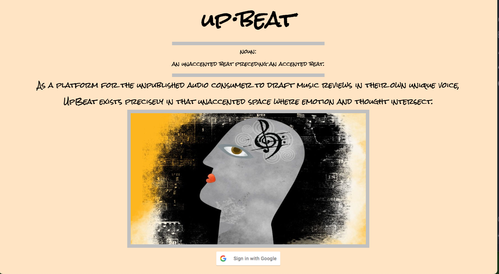

# **UpBeat**

---

Inspired by my dearest friends, I concocted UpBeat to provide a safe place for music lovers to share reviews of their favorite albums. Users are able to submit an album to the community, write a review for it, and write reviews for other submitted allbums.

## Getting Started

I would love to see you join the UpBeat community. Just head to the link below!

<https://upbeats.herokuapp.com/>

Here's a link to some planning:

<https://trello.com/b/BnWISM3V/sei-unit-2-project-upbeat>

## Next Steps:

- Album Artwork!!!
- Profile Capability: favorites, comments, etc.
- Less text-based
- Search capability

## Technologies Used

